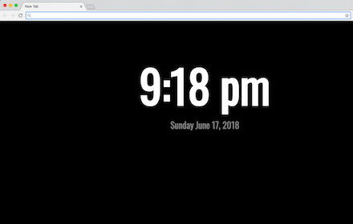

# New Tab Chrome Extension

The purpose of this project was to learn JS, HTML, and CSS through building a chrome extension that displays time on the new tab page. After this was completed, a playable tic tac toe game was added as a secondary challenge.

The game page needs a few improvements, but I'm leaving it as is for now because the goal was to just get a working games. In the future though, I hope to remove the ability to overwrite moves and add a few more features.

The tic tac toe game could also use some improvements. For example, the computer's logic is simply to put its piece down in the next available spot. Therefore, my chief goal for this game is to add more rules to the computer's game play, but I'm currently pursuing this outside of the constraints of an extension.  